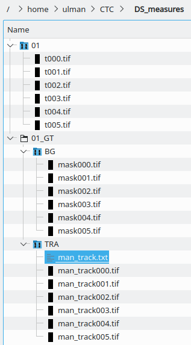

Welcome
-------
This is a repository with Java source codes of tools related to the [Cell Tracking Challenge](http://www.celltrackingchallenge.net), and to the quantitative evaluation of biomedical segmentation and tracking in general.
In particular, one can find here:

* Technical (developer-oriented) tracking and segmentation measures: TRA, SEG, DET
* Biological (user-oriented) measures: CT, TF, BC(i), CCA
* Dataset quality measures: SNR, CR, Hetb, Heti, Res, Sha, Den, Cha, Ove, Mit
* Tracking accuracy evaluation with general [Acyclic Oriented Graphs Measure (AOGM)](http://journals.plos.org/plosone/article?id=10.1371/journal.pone.0144959)

The measures were used in the paper [An objective comparison of cell-tracking algorithms](http://dx.doi.org/10.1038/nmeth.4473) and are,
together with the detection accuracy measure DET, complementing the measures used in the [Challenge](http://www.celltrackingchallenge.net).

The ideas, that are implemented in the tools, are product of a collective collaboration between colleagues who
were at that time affiliated with the following groups: [CIMA](http://www.cima.es),
[CBIA](http://cbia.fi.muni.cz), [Erasmus MC](https://www.erasmusmc.nl/oic/?lang=en), [UC3M](https://www.uc3m.es),
[CSBD](http://www.csbdresden.de/) and [MPI-CBG](http://mpi-cbg.de).

The tools were developed and the page is maintained by [Vladimír Ulman](http://www.fi.muni.cz/~xulman/).
The SEG, TRA/AOGM and DET measures were originally developed in C++ by [Martin Maška](http://cbia.fi.muni.cz/).


Installation
------------
The source codes here compile (for example, using `mvn clean package`) into a library,
into a single `.jar` file. A GUI that exposes most of the functionality of this library exists
in the form of a [Fiji GUI plugin](https://github.com/CellTrackingChallenge/fiji-plugins).

This is a maven project. You can make it available in your maven projects with the following clauses:
```
	<repositories>
		<repository>
			<id>scijava.public</id>
			<url>https://maven.scijava.org/content/groups/public</url>
		</repository>
		<repository>
			<id>it4i</id>
			<url>https://artifactory.cs.vsb.cz/it4i/</url>
		</repository>
	</repositories>

	<dependencies>
		<dependency>
			<groupId>net.celltrackingchallenge</groupId>
			<artifactId>CTC-measures</artifactId>
			<version>1.0.0</version>
		</dependency>
	</dependencies>
```


Example
-------
[Here, one can find example of the API calls](https://github.com/CellTrackingChallenge/measures/blob/e4ac070475b7c50d0d89aecf3c4e74396437eda4/src/test/java/net/celltrackingchallenge/measures/TestMeasures.java#L74) to have the seven (TRA.... CCA) measures calculated over your data.

The data needs to be, however, organized in a special way [(see Naming and Content conventions)](http://public.celltrackingchallenge.net/documents/Naming%20and%20file%20content%20conventions.pdf):


Dataset Measures
----------------
There are also ten DS (DataSet) measures available in this library. These measures shall, well, *measure* quantitatively
the difficulty of a given time-lapse video from ten different cell segmentation and tracking points of view.

The measures work with series of `.tif` files that need to adhere to the format of the Challenge. Additionally, however,
the measures require one more piece of annotation, and that is the **BG mask**, which is stored as a series of gray scale,
8 bits/pixel `.tif` files in which non-zero pixel values **denote a true background** in the images. This gives additional
control to the user to decide and choose exactly which pixels she wants to be considered as the background in the images.
It is especially handy in cases where not necessarily every nuclei/cells were segmented well and thus, for example,
taking a simple complement from all foreground pixels would have actually also covered the non-segmented nuclei/cells.

One more speciality of the DS measures is that they work with **`man_track*.tif`** files, just like the technical measures,
but they **expect different content**. While the Challenge specification requires that the `man_track*.tif` files will
be containing the detection markers, the DS measures further assume that the markers are essentially **full segments**.
The DS measures simply treat pixels with non-zero values as pixels **denoting a true foreground**, e.g., a nucleus or a cell.
The simple-shaped TRA/DET markers, according to their original purpose, are clearly not adequate. Needless to say, for the
DS measures to provide believable numbers, the foreground (and background too) masks must be reasonably accurate.

Here is an example of the expected files layout:


